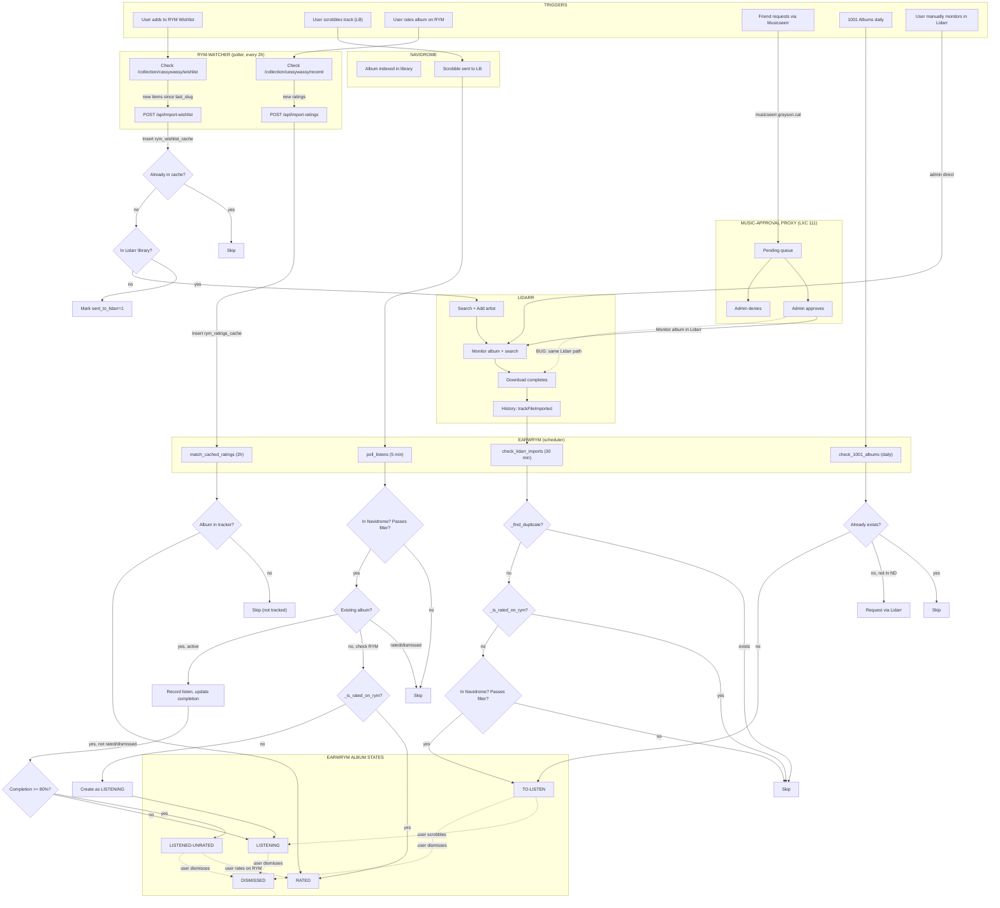

# Earwrym — Complete Flow Analysis

## Mermaid Diagram

## Problems Identified

### CRITICAL: Friend requests appear in to-listen queue

**Flow**: Friend requests on Musicseerr → approved → Lidarr monitors → downloads → `check_lidarr_imports()` picks it up → adds to to-listen.

**Why**: `check_lidarr_imports()` monitors ALL Lidarr history events. It cannot distinguish between:
- Albums the user requested (via RYM wishlist or direct Lidarr)  
- Albums friends requested (via Musicseerr → approval proxy)

**Current guards** (insufficient for this case):
- `_find_duplicate()` — only blocks if album already tracked
- `_is_rated_on_rym()` — only blocks if user already rated it
- `passes_filter()` — only blocks < 4 tracks / < 8 min

A friend requesting "Random Artist - Random Album" that the user has never heard of WILL appear in their to-listen queue.

### Proposed Fix

Only add Lidarr imports to to-listen if **at least one** of:
1. Album is in `rym_wishlist_cache` (user explicitly wishlisted it)
2. Artist has other albums rated by user in `rym_ratings_cache` (user cares about this artist)
3. Album source tag = "1001albums" (from daily generator)

This filters out pure friend requests while keeping the user's own pipeline working.

### MINOR: Double-entry risk for wishlist → Lidarr → to-listen

**Flow**: User wishlists album → poller sends to Lidarr → Lidarr downloads → `check_lidarr_imports` adds to to-listen → Meanwhile, Navidrome indexes it → `poll_listens` might also try to create it.

**Guards**: `_find_duplicate()` should catch this since both paths check artist+title. Working correctly.

### MINOR: Completion estimation from backfill is unreliable

**Issue**: LB stats report total listens (including repeated tracks), not unique tracks heard. Backfill divided total_listens / track_count, which overestimates completion (e.g., Tool albums marked "listened-unrated" when user only heard a few tracks repeatedly).

**Guard**: User can dismiss these. Going forward, real-time polling uses `COUNT(DISTINCT track_name)` which is accurate.
